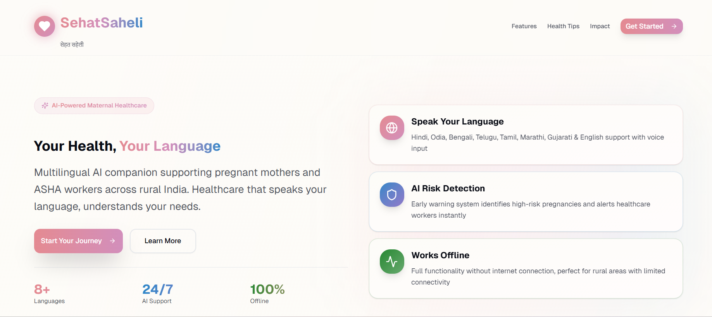
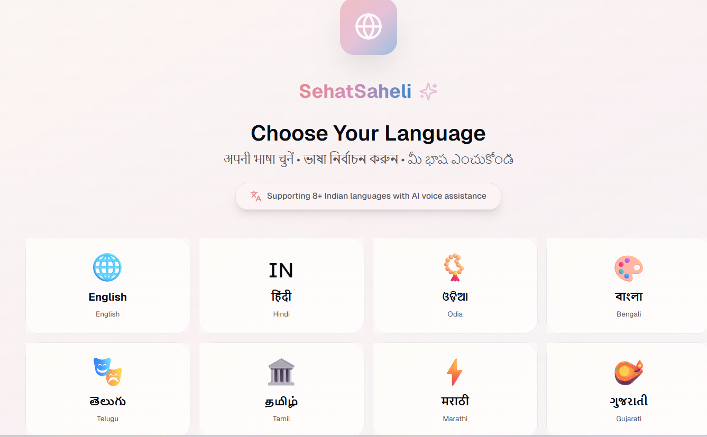
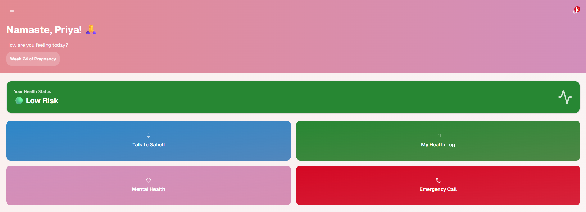
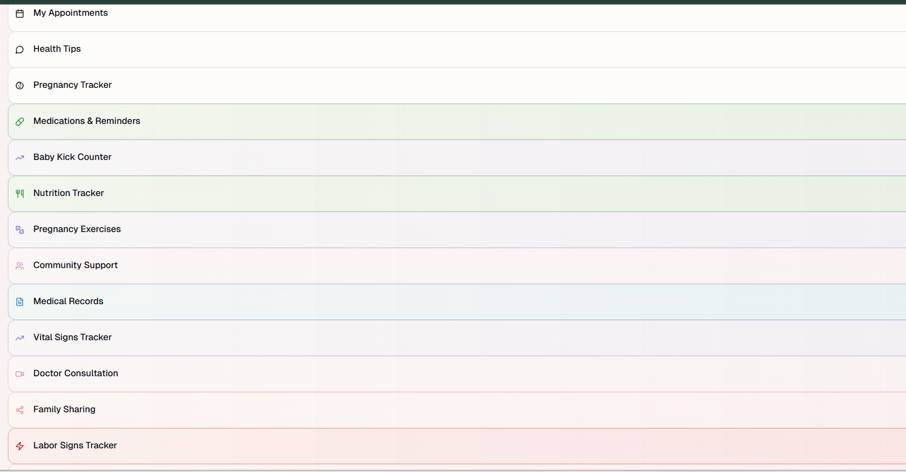
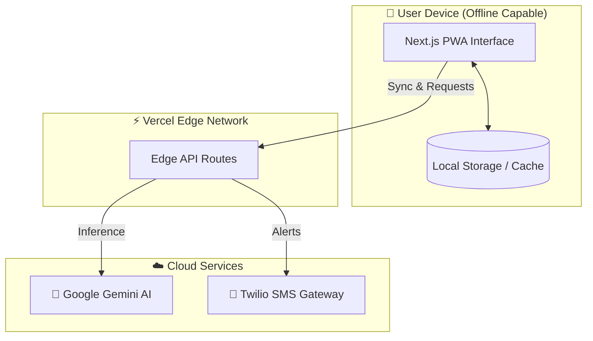

# 🤰 Sehat Saheli (सेहत सहेली)

**Bridging the Gap in Maternal Healthcare with AI & Compassion**

[](https://sehat-saheli.vercel.app/)
[](https://ghcindia.anitab.org/)
[](LICENSE)

> *"Healthcare that speaks your language, understands your needs."*

---

## 📖 Table of Contents
- [The Problem](#-the-problem)
- [Our Solution](#-our-solution)
- [Key Features](#-key-features)
- [Technology Stack](#-technology-stack)
- [System Architecture](#-system-architecture)
- [Getting Started](#-getting-started)
- [Future Roadmap](#-future-roadmap)
- [The Team](#-the-team)

---

## 🚩 The Problem
In rural India, maternal mortality remains a critical challenge due to:
1.  **Language Barriers:** Health information is often not available in local dialects.
2.  **Limited Access:** ASHA workers are overburdened, making frequent home visits difficult.
3.  **Lack of Awareness:** Early warning signs of high-risk pregnancies are often missed.

## 💡 Our Solution
**Sehat Saheli** is an AI-powered digital companion that empowers both expectant mothers and ASHA workers. It acts as a bridge, providing 24/7 medical guidance in native languages while streamlining patient management for healthcare workers.

---

## ✨ Key Features

### 🌐 Inclusive & Accessible
*   **Multilingual AI:** Fluent in **8+ Indian languages** (Hindi, Odia, Bengali, Telugu, Tamil, Marathi, Gujarati, English).
*   **Voice-First Design:** Speak to the app naturally—perfect for users with limited literacy.
*   **Offline-First:** Critical features work without internet, syncing data when connectivity returns.

### 🤰 For Mothers (The "Saheli" Experience)
*   **🤖 AI Health Assistant:** Instant answers to pregnancy queries via Google Gemini.
*   **📊 Smart Trackers:**
    *   *Kick Counter* & *Contraction Timer*
    *   *Nutrition Planner* (Local diet recommendations)
    *   *Vital Signs Log*
*   **🆘 SOS Emergency:** One-tap alert system sending GPS location to family & ASHA workers.
*   **🧠 Mental Wellness:** Guided meditation and emotional support tools.

### 👩‍⚕️ For ASHA Workers
*   **📋 Digital Register:** Replace paper logs with a smart patient database.
*   **⚠️ AI Risk Scoring:** Auto-detection of high-risk pregnancies based on reported symptoms.
*   **📅 Smart Scheduler:** Automated reminders for ANC visits and immunizations.

---

## 📸 User Interface

| **Landing Page** | **Multilingual Support** |
|:---:|:---:|
|  |  |
| *Accessible & Welcoming Home* | *Support for 8+ Languages* |

| **Smart Dashboard** | **Comprehensive Tools** |
|:---:|:---:|
|  |  |
| *Personalized Health Status* | *All-in-one Health Tracker* |

---

## 🛠️ Technology Stack

| Category | Technologies |
|----------|--------------|
| **Frontend** |    |
| **UI Components** |   |
| **AI & ML** |   |
| **Backend** |   |
| **Communication** |  |

---

## 🏗️ System Architecture

Sehat Saheli is built on a **Serverless Edge Architecture**, specifically designed to function reliably in rural areas with intermittent internet connectivity.

### 1. The "Offline-First" Client Layer (Frontend)
*   **Technology:** Next.js 14 (App Router), React, Tailwind CSS.
*   **Role:** Serves as the primary interface for Mothers and ASHA workers.
*   **Key Feature:** It is a **Progressive Web App (PWA)**. This means the app caches essential resources and data locally on the device. Users can access health tips, view their records, and use tools like the "Kick Counter" even without an internet connection.

### 2. The High-Performance Edge Layer (Backend)
*   **Technology:** Vercel Edge Functions.
*   **Role:** Handles API requests (like chat messages or symptom checks).
*   **Why Edge?** Instead of running on a single server far away, our code runs on servers geographically closer to the user. This drastically reduces latency, ensuring the app feels instant even on slower 2G/3G networks.

### 3. The Intelligence Layer (AI)
*   **Technology:** Google Gemini Pro via Vercel AI SDK.
*   **Role:** The "Brain" of Sehat Saheli.
*   **Function:** It processes natural language voice/text inputs, translates them, and provides medical guidance based on safe, pre-prompted contexts. It also analyzes symptom data to detect potential risks.

### 4. The Communication Layer
*   **Technology:** Twilio API.
*   **Role:** Bridges the digital and physical worlds.
*   **Function:** Sends critical SMS alerts to family members and ASHA workers during emergencies (SOS) or for routine appointment reminders.



---

## 🚀 Getting Started

To run the project locally:

1.  **Clone the repository**
    ```bash
    git clone https://github.com/aryanb1906/Sehat-Saheli.git
    cd Sehat-Saheli
    ```

2.  **Install dependencies**
    ```bash
    npm install
    # or
    pnpm install
    ```

3.  **Set up Environment Variables**
    Create a `.env.local` file:
    ```env
    GEMINI_API_KEY=your_google_api_key
    TWILIO_ACCOUNT_SID=your_sid
    TWILIO_AUTH_TOKEN=your_token
    TWILIO_PHONE_NUMBER=your_number
    ```

4.  **Run the development server**
    ```bash
    npm run dev
    ```

---

## 🔮 Future Roadmap

*   [ ] **Telemedicine Integration:** Video calls with doctors.
*   [ ] **IoT Integration:** Sync with smart wearables for vitals monitoring.
*   [ ] **Community Forum:** Anonymous peer support groups for mothers.
*   [ ] **Govt. Scheme Integration:** Direct enrollment in schemes like JSY/PMMVY.

---

## 👥 The Team

Built with ❤️ by **Team Sehat Saheli**

*   👨‍💻 **Aryan Bhargava** - Full Stack & AI Lead
*   👨‍💻 **Naman Surana** - Frontend & UX
*   👨‍💻 **Vaidik** - Backend & Architecture
*   👩‍💻 **Shrinkhala** - Research & Content

---
