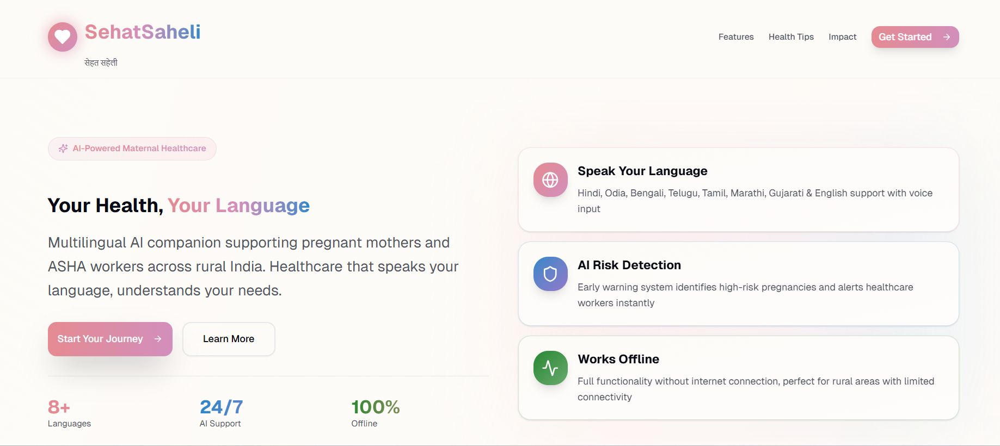
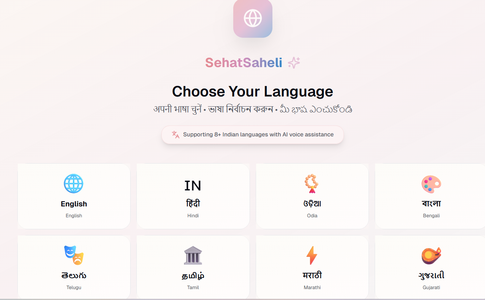
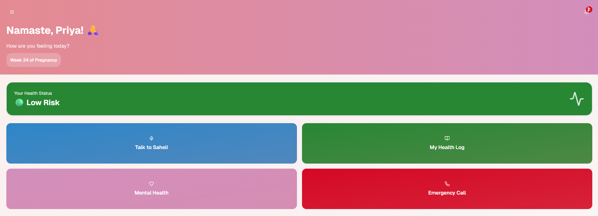
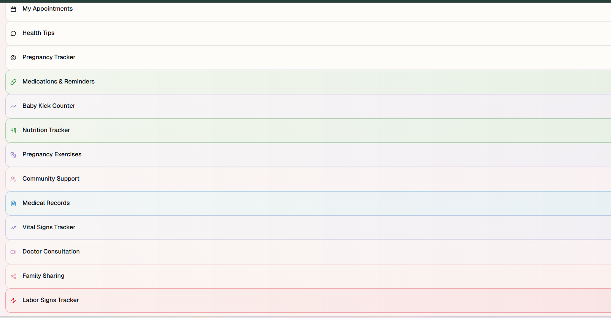
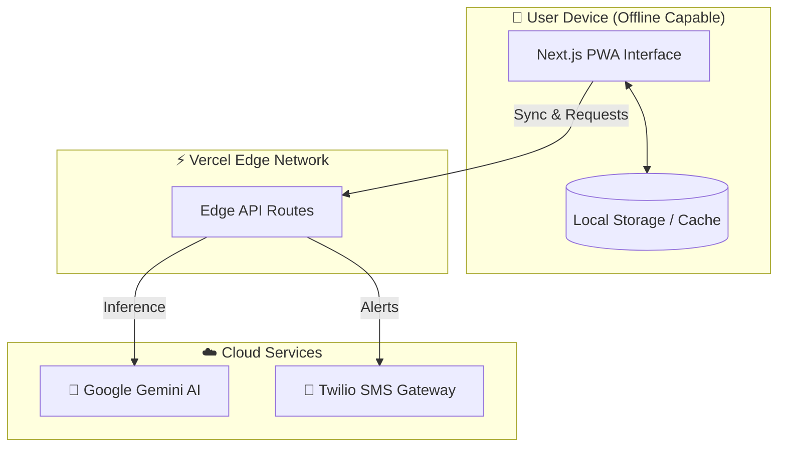

# 🤰 Sehat Saheli (सेहत सहेली)

**Bridging the Gap in Maternal Healthcare with AI & Compassion**

[](https://sehat-saheli.vercel.app/)
[](https://ghcindia.anitab.org/)
[](LICENSE)

> *"Healthcare that speaks your language, understands your needs."*

---

## 📖 Table of Contents
- [The Problem](#-the-problem)
- [Our Solution](#-our-solution)
- [Latest Platform Update (March 2026)](#-latest-platform-update-march-2026)
- [Key Features](#-key-features)
- [End-to-End Product Workflow](#-end-to-end-product-workflow)
- [Technology Stack](#-technology-stack)
- [System Architecture](#-system-architecture)
- [Getting Started](#-getting-started)
- [Future Roadmap](#-future-roadmap)
- [The Team](#-the-team)

---

## 🚩 The Problem
In rural India, maternal mortality remains a critical challenge due to:
1.  **Language Barriers:** Health information is often not available in local dialects.
2.  **Limited Access:** ASHA workers are overburdened, making frequent home visits difficult.
3.  **Lack of Awareness:** Early warning signs of high-risk pregnancies are often missed.

## 💡 Our Solution
**Sehat Saheli** is an AI-powered digital companion that empowers both expectant mothers and ASHA workers. It acts as a bridge, providing 24/7 medical guidance in native languages while streamlining patient management for healthcare workers.

---

## 🚀 Latest Platform Update (March 2026)

This release includes both the previously completed platform foundations and the latest production updates delivered today.

### ✅ Highlights Added Today

1. **Voice Assistant 2.0**
    - Dedicated settings panel: language override, auto-listen toggle, speaking speed.
    - Voice intent analytics logging with success/failure trends.
    - Expanded intents for mother + ASHA workflows:
      - Appointments, medications, lab reports, community navigation.
      - ASHA dashboard, patients, tasks, analytics navigation.
    - New voice APIs:
      - `POST /api/voice-assistant/parse`
      - `POST/GET /api/voice-assistant/analytics`

2. **Care Governance and Safety Layer**
    - Privacy consent controls API with version history and revoke flows.
    - Referral workflow API with SLA breach detection and escalation readiness.
    - Audit logging APIs for admin-grade activity monitoring.
    - Idempotency safeguards for mutation endpoints.
    - Structured observability helpers with timing/error instrumentation.

3. **Clinical Decision Support APIs**
    - Maternal risk assessment endpoint (`/api/maternal-risk`) with trend-aware scoring and action plans.
    - Medication safety endpoint (`/api/medication-safety`) with pregnancy-safe guidance labels.

4. **Offline Reliability Enhancements**
    - Offline write queue client with automatic replay on reconnect.
    - Conflict detection + lightweight resolver UI for failed sync operations.

5. **Role and Security Hardening**
    - Stronger role guards in middleware for mother/ASHA/doctor/admin route boundaries.
    - API auth utilities and standardized API error responses.

6. **Localization + UX Continuity**
    - Mother dashboard and sidebar labels aligned to multilingual content keys.
    - Hindi/English display consistency in primary dashboard actions and test selectors.

### ✅ Existing Foundations Preserved

- NextAuth authentication and role-aware access model.
- Prisma + PostgreSQL data model integration.
- Real-time and persistent chat infrastructure.
- Video consultation persistence layer.
- PWA + performance baseline (manifest, service worker, web vitals).

### 🧪 Validation Snapshot

- Unit and route tests passing in latest run: **13/13 tests passed**.
- New and updated test coverage includes referrals, privacy consent, emergency and lab route auth/validation, and smoke route protections.

---

## ✨ Key Features

### 🌐 Inclusive & Accessible
*   **Multilingual AI:** Fluent in **8+ Indian languages** (Hindi, Odia, Bengali, Telugu, Tamil, Marathi, Gujarati, English).
*   **Voice-First Design:** Speak to the app naturally—perfect for users with limited literacy.
*   **Offline-First:** Critical features work without internet, syncing data when connectivity returns.

### 🤰 For Mothers (The "Saheli" Experience)
*   **🤖 AI Health Assistant:** Instant answers to pregnancy queries via Google Gemini.
*   **📊 Smart Trackers:**
    *   *Kick Counter* & *Contraction Timer*
    *   *Nutrition Planner* (Local diet recommendations)
    *   *Vital Signs Log*
*   **🆘 SOS Emergency:** One-tap alert system sending GPS location to family & ASHA workers.
*   **🧠 Mental Wellness:** Guided meditation and emotional support tools.

### 👩‍⚕️ For ASHA Workers
*   **📋 Digital Register:** Replace paper logs with a smart patient database.
*   **⚠️ AI Risk Scoring:** Auto-detection of high-risk pregnancies based on reported symptoms.
*   **📅 Smart Scheduler:** Automated reminders for ANC visits and immunizations.

---

## ✨ UI/UX Improvements (Production-Ready)

### 🎨 13 Core Usability Improvements

All 8 pages now feature professional UI/UX patterns:

| # | Improvement | Implementation | Pages |
|---|-------------|-----------------|-------|
| 1️⃣ | **Skeleton Loading** | Smooth placeholder animations while data loads | All 8 |
| 2️⃣ | **Empty States** | Friendly cards with icons & CTAs when no data exists | All 8 |
| 3️⃣ | **Form Validation** | Real-time error messages with visual feedback | Video Consult, Symptom Check |
| 4️⃣ | **Progressive Disclosure** | Multi-step forms (3-step booking wizard) | Video Consultation |
| 5️⃣ | **Toast Notifications** | Non-intrusive success/error alerts | All 8 pages |
| 6️⃣ | **Responsive Media** | Adaptive layouts for all screen sizes | All 8 |
| 7️⃣ | **Dark Mode Ready** | Theme system prepared in `theme-provider.tsx` | Framework ready |
| 8️⃣ | **Accordion Sections** | Collapsible content for danger signs, FAQs | Danger Signs Monitor |
| 9️⃣ | **Lazy Loading** | Image & component optimization templates | Documented |
| 🔟 | **Typography** | `leading-relaxed` for 1.625 line-height readability | All 8 |
| 1️⃣1️⃣ | **Spacing** | Consistent `gap-4` (1rem) & `gap-6` (1.5rem) | All 8 |
| 1️⃣2️⃣ | **Color Contrast** | WCAG AA compliant text/background ratios | All 8 |
| 1️⃣3️⃣ | **Touch Targets** | All buttons minimum `h-11` (44px+) height | All 8 |

### 🚀 5 Quick Wins (Rapid Polish)

✅ **Toast Buttons** - All action buttons confirm with toast notifications  
✅ **Empty States** - Friendly UI cards when data is absent  
✅ **Consistent Spacing** - `gap-4` standardization across layouts  
✅ **Skeleton Loading** - Improved perceived performance  
✅ **Typography** - `leading-relaxed` for better readability  

### 📱 Pages Enhanced

1. **🥗 Nutrition Planner** - Recipe discovery with validation
2. **🧪 Lab Reports** - Medical records management with timeline view
3. **📹 Video Consultation** - 3-step progressive booking form
4. **🚨 Danger Signs Monitor** - Emergency detection with SOS integration
5. **👥 Support Groups** - Community learning with filtered discovery
6. **🔍 Symptom Checker** - AI analysis with severity-based actions
7. **📋 ASHA Task Management** - Priority-based task tracking with real-time updates
8. **📊 Analytics Dashboard** - ASHA performance metrics with progress bars

---

## 🔄 End-to-End Product Workflow

### 1. Mother Journey
1. Mother signs in (or enters allowed guest flow where configured).
2. Uses dashboard tools for symptoms, medications, appointments, emergency readiness, and family sharing.
3. Uses voice assistant in Hindi/English to execute actions hands-free.
4. Receives guidance from risk + safety APIs (maternal risk scoring, medication safety signals).
5. Data is persisted and, if offline, queued for safe sync when connectivity returns.

### 2. ASHA Journey
1. ASHA accesses patient/task dashboards using role-secured routes.
2. Uses task and analytics views for daily workload management.
3. Can navigate quickly via expanded voice intents.
4. Automation planning endpoint supports prioritized work and routing bundles.

### 3. Referral and Consent Governance
1. Referral is generated with tracked status and SLA timeline.
2. Breach conditions are surfaced as alerts for follow-up.
3. Privacy consent is saved with versioned history.
4. Revoke flow is supported and audit-ready.

### 4. Audit and Observability Flow
1. Sensitive API actions can emit structured audit events.
2. Latency/error instrumentation is captured via observability helpers.
3. Admin audit viewer page provides role-filtered operational traceability.

### 5. Development Workflow
1. Install and configure:
    - `pnpm install`
    - `pnpm prisma:generate`
    - `pnpm prisma:push` (with active DB)
2. Run app:
    - `pnpm dev`
3. Run tests:
    - `pnpm test`
4. Optional smoke checks:
    - `pnpm exec playwright test`

---

## 📸 User Interface

| **Landing Page** | **Multilingual Support** |
|:---:|:---:|
|  |  |
| *Accessible & Welcoming Home* | *Support for 8+ Languages* |

| **Smart Dashboard** | **Comprehensive Tools** |
|:---:|:---:|
|  |  |
| *Personalized Health Status* | *All-in-one Health Tracker* |

---

## 🎥 See it in Action

> **Experience our Multilingual AI Chatbot**
>
> [**▶️ Watch Demo Video**](https://drive.google.com/file/d/1LQS_r2vxWhAqhxQomfBfc5dpiAB3wc5T/view?usp=drive_link)
> *(Click to watch the AI speak in Hindi!)*

---

## 🛠️ Technology Stack

| Category | Technologies |
|----------|--------------|
| **Frontend** |    |
| **UI Components** |   |
| **AI & ML** |   |
| **Backend** |   |
| **Communication** |  |

---

## 🏗️ Architecture & Data Flow

Sehat Saheli is engineered with a **Serverless Edge Architecture**, prioritizing speed, accessibility, and reliability for rural connectivity.

### 🔄 How it Works: The MVP Journey

1.  **The Offline-First Interface (PWA)**
    *   **User Action:** A mother in a remote village opens the app. Even with **zero internet**, she can access her health logs, nutrition plans, and emergency contacts.
    *   **Tech:** Built with **Next.js 14**, the app caches critical data locally on her device using `localStorage` and Service Workers.

2.  **The Edge Connectivity Layer**
    *   **Process:** When she asks a question via voice or text, the request travels to the nearest **Vercel Edge Function**.
    *   **Benefit:** Unlike traditional servers, "Edge" servers are geographically distributed. This means the app responds instantly, even on slow 2G/3G networks common in rural India.

3.  **The AI Intelligence Engine**
    *   **Analysis:** The Edge function securely sends her query to **Google Gemini Pro**.
    *   **Logic:** The AI detects the language (e.g., Hindi), translates it, analyzes the medical context (e.g., "I have a headache"), and generates a safe, medically-verified response.
    *   **Risk Detection:** If symptoms indicate danger (e.g., high BP), the AI flags it immediately.

4.  **The Bridge to Reality (Communication)**
    *   **Action:** For high-risk alerts or SOS triggers, the system invokes the **Twilio API**.
    *   **Result:** An SMS is instantly sent to her registered ASHA worker and family members with her GPS location, bridging the digital gap to physical aid.

### ⚙️ Technical Architecture Breakdown

| Layer | Technology | Role |
| :--- | :--- | :--- |
| **1. Client Layer** | **Next.js 14 (PWA)** | **Offline-First UI:** Caches resources locally. Handles user interaction, voice input, and displays health data. |
| **2. Edge Layer** | **Vercel Edge Functions** | **Low-Latency API:** Processes requests closest to the user, ensuring speed on 2G/3G networks. |
| **3. Intelligence Layer** | **Google Gemini Pro** | **The "Brain":** Handles natural language understanding, translation, and medical symptom analysis. |
| **4. Communication Layer** | **Twilio API** | **SMS Gateway:** Sends critical alerts and reminders to feature phones (non-smartphones). |


```mermaid
graph TD
    subgraph User_Device ["📱 User Device (Offline Capable)"]
        UI[Next.js PWA Interface]
        LocalDB[(Local Storage / Cache)]
        UI <--> LocalDB
    end

    subgraph Edge_Network ["⚡ Vercel Edge Network"]
        API[Edge API Routes]
    end

    subgraph Cloud_Services ["☁️ Cloud Services"]
        Gemini[🧠 Google Gemini AI]
        Twilio[📡 Twilio SMS Gateway]
    end

    UI -->|Sync & Requests| API
    API -->|Inference| Gemini
    API -->|Alerts| Twilio
```

---

## 🚀 Getting Started

To run the project locally:

1.  **Clone the repository**
    ```bash
    git clone https://github.com/aryanb1906/Sehat-Saheli.git
    cd Sehat-Saheli
    ```

2.  **Install dependencies**
    ```bash
    npm install
    # or
    pnpm install
    ```

3.  **Set up Environment Variables**
    Create a `.env.local` file:
    ```env
    GEMINI_API_KEY=your_google_api_key
    TWILIO_ACCOUNT_SID=your_sid
    TWILIO_AUTH_TOKEN=your_token
    TWILIO_PHONE_NUMBER=your_number
    ```

4.  **Run the development server**
    ```bash
    npm run dev
    ```

---

## 🔮 Future Roadmap

*   [ ] **Telemedicine Integration:** Video calls with doctors.
*   [ ] **IoT Integration:** Sync with smart wearables for vitals monitoring.
*   [ ] **Community Forum:** Anonymous peer support groups for mothers.
*   [ ] **Govt. Scheme Integration:** Direct enrollment in schemes like JSY/PMMVY.

---

## ✅ Top 5 Priorities Implemented (Current Sprint)

The following high-priority foundation work has been implemented in this update:

1. **Authentication System**
    - NextAuth-based auth flow with credentials and optional Google OAuth.
    - Role-ready user model (`MOTHER`, `ASHA`, `DOCTOR`).
    - Signup API and signin/register pages.
    - Protected route middleware for `/mother/*`, `/asha/*`, and `/doctor/*`.

2. **Database Integration (Prisma + PostgreSQL)**
    - Prisma schema added for `User`, `ChatRoom`, `ChatMessage`, and `VideoConsultation`.
    - Shared Prisma client utility in `lib/prisma.ts`.
    - Prisma scripts added: `prisma:generate`, `prisma:push`, `prisma:studio`.

3. **Real-time Chat Infrastructure**
    - New persistent messaging endpoints:
      - `GET/POST /api/chat/messages`
      - `GET /api/chat/stream` (SSE stream for near real-time updates)
    - Database-backed conversation and message storage.
        - Mother chat screen now supports **Doctor Chat mode** wired to these endpoints.

4. **Video Consultation Persistence**
    - `app/api/video-consultation/route.ts` migrated from mock-only to DB-backed CRUD.
    - Existing UI compatibility preserved while enabling persisted appointments.

5. **Performance & Offline Foundations**
    - Next.js image optimization enabled with AVIF/WebP formats.
    - Package import optimization for `lucide-react` and `recharts`.
    - Web Vitals capture hook added.
    - PWA basics added: manifest + service worker registration.

### ✅ Additional Improvements Completed (Follow-up Batch)

- **Frontend wiring completed:**
    - `app/mother/talk/page.tsx` now supports two modes:
        - `AI Saheli` (existing Gemini flow)
        - `Doctor Chat` (real-time + persisted via `/api/chat/messages` and `/api/chat/stream`)
- **API hardening completed:**
    - Added shared in-memory rate limiter utility in `lib/rate-limit.ts`.
    - Applied throttling to:
        - `/api/auth/register`
        - `/api/auth/token`
        - `/api/chat/messages`
        - `/api/chat/stream`
        - `/api/video-consultation`
    - Strengthened Zod validation for token refresh and consultation update payloads.
- **First-run developer bootstrap completed:**
    - Added Prisma seed script `prisma/seed.js`.
    - Added command: `npm run prisma:seed` for demo users/chat/consultation data.

### New Environment Variables

Copy `.env.example` to `.env.local` and configure:

```env
DATABASE_URL="postgresql://..."
AUTH_SECRET="..."
AUTH_URL="http://localhost:3000"
GOOGLE_CLIENT_ID=""
GOOGLE_CLIENT_SECRET=""
GEMINI_API_KEY=""
```

### Setup Commands

```bash
npm install
npm run prisma:generate
npm run prisma:push
npm run prisma:seed
npm run dev
```

---

## 🎯 Suggested Frontend Improvements (Next Phase)

### 🎨 Design & UX Enhancements
- **Auth System**: User login/signup with role-based access (Mother, ASHA, Doctor)
- **Persistent State**: Redux/Zustand for app-wide state management
- **PWA Offline Mode**: Full offline capability with service workers & sync
- **Dark Mode**: Enable dark/light theme toggle with system preference detection
- **Animations**: Micro-interactions (smooth page transitions, button feedback)
- **Mobile-First**: Bottom navigation for mobile, sidebar for desktop
- **Accessibility**: WCAG AAA compliance, screen reader support, keyboard navigation
- **Internationalization**: i18n setup for multi-language switching

### 📊 Feature Enhancements
- **Charts & Graphs**: Trend visualization for health metrics (Recharts/Chart.js)
- **Notifications**: Push notifications for appointments & alerts
- **Calendar Integration**: Google Calendar sync for doctor appointments
- **File Upload**: Report upload with drag-drop support
- **Real-time Chat**: Doctor-patient messaging system
- **Video Call**: In-app video consultation (Jitsi/Agora.io)
- **AR Medical Guide**: Augmented Reality for exercises/techniques
- **Gamification**: Badges & streaks for completing health tasks

### ⚡ Performance Optimization
- **Code Splitting**: Dynamic imports for route-based bundles
- **Image Optimization**: Next.js Image with WebP format & lazy loading
- **CSS Optimization**: Critical CSS extraction, unused CSS removal
- **Caching Strategy**: Service worker caching patterns (stale-while-revalidate)
- **Monitoring**: Sentry for error tracking, Web Vitals monitoring
- **Testing**: Vitest for unit tests, Playwright for E2E tests (target: >80% coverage)

---

## 🔧 Suggested Backend Improvements (Next Phase)

### 🗄️ Data & Database
- **Database**: PostgreSQL/MongoDB for persistent data storage
- **Real-time Sync**: Socket.io for live updates (task assignments, chat)
- **Caching Layer**: Redis for session management & frequent queries
- **Data Backup**: Automated backups with disaster recovery
- **Data Privacy**: HIPAA compliance, encryption at rest & in transit

### 🔐 Security & Authentication
- **Auth**: JWT + refresh tokens for stateless authentication
- **OAuth**: Google/Apple sign-in integration
- **2FA**: Two-factor authentication for sensitive actions
- **Rate Limiting**: API rate limiting to prevent abuse
- **Input Validation**: Zod/Yup for schema validation
- **CORS**: Proper CORS policies for cross-origin access

### 🤖 AI & ML Features
- **Doctor Matching**: Algorithm to suggest relevant specialists
- **Predictive Analytics**: Risk scoring model (training with anonymized data)
- **NLP Improvements**: Better language understanding for Hindi/Odia
- **Sentiment Analysis**: Detect anxiety/depression from text
- **Recommendation Engine**: Personalized health tips based on pregnancy stage

### 📱 API & Integration
- **RESTful API**: Full REST API with OpenAPI/Swagger documentation
- **GraphQL**: Optional GraphQL endpoint for flexible queries
- **Webhooks**: Third-party integrations (SMS, email, calendar)
- **GIS Integration**: Map-based ASHA worker/hospital finder
- **Telemedicine**: Doctor profiles, scheduling, video call APIs
- **Government APIs**: Integration with HMIS/NVHP databases

### 📊 Analytics & Monitoring
- **Analytics**: Mixpanel/Segment for user behavior tracking
- **Error Tracking**: Sentry for production error monitoring
- **APM**: Application performance monitoring (New Relic/DataDog)
- **Logs**: Centralized logging (ELK Stack/Cloudwatch)
- **Metrics**: Prometheus for system metrics

### 🧪 Quality Assurance
- **Unit Tests**: Jest for backend logic testing
- **Integration Tests**: Database tests with fixtures
- **Load Testing**: k6/JMeter for stress testing
- **API Tests**: Postman/REST Client collections
- **Security Testing**: OWASP scanning & dependency audits

---

## 🔮 Future Roadmap (Extended)

---

## 👥 The Team

Built with ❤️ by **Team Sehat Saheli**

*   👨‍💻 **Aryan Bhargava** - Full Stack & AI Lead &nbsp; [](https://github.com/aryanb1906) [](https://www.linkedin.com/in/aryan-bhargava)
*   👨‍💻 **Naman Surana** - Frontend & UX Lead &nbsp; [](https://github.com/newman05) [](https://www.linkedin.com/in/naman-surana-work)
*   👨‍💻 **Vaidik** - Backend & Architecture Lead &nbsp; [](https://github.com/Vaidik-7781) [](https://www.linkedin.com/in/vaidik-gupta-ss2311383/)
*   👩‍💻 **Shrinkhala** - Research & ML Lead &nbsp; [](https://github.com/Shrinkhalaa27) [](https://www.linkedin.com/in/shrinkhala-anand-484998274/)

---
