# 🤰 Sehat Saheli (सेहत सहेली)

**Bridging the Gap in Maternal Healthcare with AI & Compassion**

[](https://sehat-saheli.vercel.app/)
[](https://ghcindia.anitab.org/)
[](LICENSE)

> *"Healthcare that speaks your language, understands your needs."*

---

## 📖 Table of Contents
- [The Problem](#-the-problem)
- [Our Solution](#-our-solution)
- [Key Features](#-key-features)
- [Technology Stack](#-technology-stack)
- [System Architecture](#-system-architecture)
- [Getting Started](#-getting-started)
- [Future Roadmap](#-future-roadmap)
- [The Team](#-the-team)

---

## 🚩 The Problem
In rural India, maternal mortality remains a critical challenge due to:
1.  **Language Barriers:** Health information is often not available in local dialects.
2.  **Limited Access:** ASHA workers are overburdened, making frequent home visits difficult.
3.  **Lack of Awareness:** Early warning signs of high-risk pregnancies are often missed.

## 💡 Our Solution
**Sehat Saheli** is an AI-powered digital companion that empowers both expectant mothers and ASHA workers. It acts as a bridge, providing 24/7 medical guidance in native languages while streamlining patient management for healthcare workers.

---

## ✨ Key Features

### 🌐 Inclusive & Accessible
*   **Multilingual AI:** Fluent in **8+ Indian languages** (Hindi, Odia, Bengali, Telugu, Tamil, Marathi, Gujarati, English).
*   **Voice-First Design:** Speak to the app naturally—perfect for users with limited literacy.
*   **Offline-First:** Critical features work without internet, syncing data when connectivity returns.

### 🤰 For Mothers (The "Saheli" Experience)
*   **🤖 AI Health Assistant:** Instant answers to pregnancy queries via Google Gemini.
*   **📊 Smart Trackers:**
    *   *Kick Counter* & *Contraction Timer*
    *   *Nutrition Planner* (Local diet recommendations)
    *   *Vital Signs Log*
*   **🆘 SOS Emergency:** One-tap alert system sending GPS location to family & ASHA workers.
*   **🧠 Mental Wellness:** Guided meditation and emotional support tools.

### 👩‍⚕️ For ASHA Workers
*   **📋 Digital Register:** Replace paper logs with a smart patient database.
*   **⚠️ AI Risk Scoring:** Auto-detection of high-risk pregnancies based on reported symptoms.
*   **📅 Smart Scheduler:** Automated reminders for ANC visits and immunizations.

---

## 📸 User Interface

| **Landing Page** | **Multilingual Support** |
|:---:|:---:|
|  |  |
| *Accessible & Welcoming Home* | *Support for 8+ Languages* |

| **Smart Dashboard** | **Comprehensive Tools** |
|:---:|:---:|
|  |  |
| *Personalized Health Status* | *All-in-one Health Tracker* |

---

## 🎥 See it in Action

> **Experience our Multilingual AI Chatbot**
>
> [**▶️ Watch Demo Video**](https://github.com/aryanb1906/Sehat-Saheli/raw/main/public/videos/chatbot-demo.mp4)
> *(Click to watch the AI speak in Hindi!)*

---

## 🛠️ Technology Stack

| Category | Technologies |
|----------|--------------|
| **Frontend** |    |
| **UI Components** |   |
| **AI & ML** |   |
| **Backend** |   |
| **Communication** |  |

---

## 🏗️ Architecture & Data Flow

Sehat Saheli is engineered with a **Serverless Edge Architecture**, prioritizing speed, accessibility, and reliability for rural connectivity.

### 🔄 How it Works: The MVP Journey

1.  **The Offline-First Interface (PWA)**
    *   **User Action:** A mother in a remote village opens the app. Even with **zero internet**, she can access her health logs, nutrition plans, and emergency contacts.
    *   **Tech:** Built with **Next.js 14**, the app caches critical data locally on her device using `localStorage` and Service Workers.

2.  **The Edge Connectivity Layer**
    *   **Process:** When she asks a question via voice or text, the request travels to the nearest **Vercel Edge Function**.
    *   **Benefit:** Unlike traditional servers, "Edge" servers are geographically distributed. This means the app responds instantly, even on slow 2G/3G networks common in rural India.

3.  **The AI Intelligence Engine**
    *   **Analysis:** The Edge function securely sends her query to **Google Gemini Pro**.
    *   **Logic:** The AI detects the language (e.g., Hindi), translates it, analyzes the medical context (e.g., "I have a headache"), and generates a safe, medically-verified response.
    *   **Risk Detection:** If symptoms indicate danger (e.g., high BP), the AI flags it immediately.

4.  **The Bridge to Reality (Communication)**
    *   **Action:** For high-risk alerts or SOS triggers, the system invokes the **Twilio API**.
    *   **Result:** An SMS is instantly sent to her registered ASHA worker and family members with her GPS location, bridging the digital gap to physical aid.

```mermaid
graph TD
    subgraph User_Device ["📱 User Device (Offline Capable)"]
        UI[Next.js PWA Interface]
        LocalDB[(Local Storage / Cache)]
        UI <--> LocalDB
    end

    subgraph Edge_Network ["⚡ Vercel Edge Network"]
        API[Edge API Routes]
    end

    subgraph Cloud_Services ["☁️ Cloud Services"]
        Gemini[🧠 Google Gemini AI]
        Twilio[📡 Twilio SMS Gateway]
    end

    UI -->|Sync & Requests| API
    API -->|Inference| Gemini
    API -->|Alerts| Twilio
```



---

## 🚀 Getting Started

To run the project locally:

1.  **Clone the repository**
    ```bash
    git clone https://github.com/aryanb1906/Sehat-Saheli.git
    cd Sehat-Saheli
    ```

2.  **Install dependencies**
    ```bash
    npm install
    # or
    pnpm install
    ```

3.  **Set up Environment Variables**
    Create a `.env.local` file:
    ```env
    GEMINI_API_KEY=your_google_api_key
    TWILIO_ACCOUNT_SID=your_sid
    TWILIO_AUTH_TOKEN=your_token
    TWILIO_PHONE_NUMBER=your_number
    ```

4.  **Run the development server**
    ```bash
    npm run dev
    ```

---

## 🔮 Future Roadmap

*   [ ] **Telemedicine Integration:** Video calls with doctors.
*   [ ] **IoT Integration:** Sync with smart wearables for vitals monitoring.
*   [ ] **Community Forum:** Anonymous peer support groups for mothers.
*   [ ] **Govt. Scheme Integration:** Direct enrollment in schemes like JSY/PMMVY.

---

## 👥 The Team

Built with ❤️ by **Team Sehat Saheli**

*   👨‍💻 **Aryan Bhargava** - Full Stack & AI Lead
*   👨‍💻 **Naman Surana** - Frontend & UX
*   👨‍💻 **Vaidik** - Backend & Architecture
*   👩‍💻 **Shrinkhala** - Research & ML Lead

---
